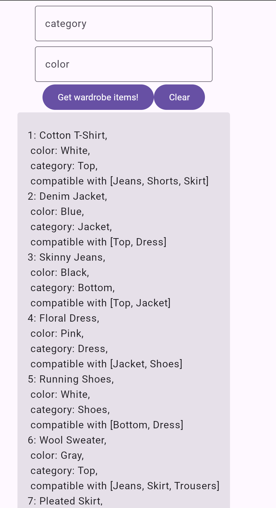

# BpWardrobeClient

Kotlin Multiplatform Library

This KMP lib utilizes the Ktor framework to make request to a hardcoded url simulating an API as a proof of concept.
The implementation is aimed to be modular, extensible and adaptable, instead of the example an actual api endpoint using url, port and entry point can easily be defined for a real world application.

So far, the library provides a service for android applications.

### Testing
The common, multiplatform code is fully tested with 100% test coverage in
```
shared/src/commonTest/kotlin/com/rodi/bonprix/WardrobeClientTest.kt
```


### UI
The app code works on

<table>
<tbody>
<tr>
<td>Android</td>
<td>Browser</td>
<td>other platforms</td>
</tr>
<tr>
<td valign="top">


</td>
<td valign="top">



</td>
<td valign="top">

work in progress, coming soon :-)

</td>
</tr>
</tbody>
</table>


### Publish to MavenLocal

1) Run `./gradlew :shared:publishToMavenLocal`
2) Open `~/.m2/repository/com/rodi/bonprix/`
3) exported `~/.m2/repository/com/rodi/bonprix/shared/1.0.0/`

A sample app was provided by default:

### Run Sample App

- Desktop JVM: `./gradlew :sample:composeApp:run`
- Android: `open project in Android Studio and run the sample app`
- iOS: `open 'sample/iosApp/iosApp.xcodeproj' in Xcode and run the sample app`
- JavaScript: `./gradlew :sample:composeApp:jsBrowserRun`
- Wasm: `./gradlew :sample:composeApp:wasmJsBrowserRun`

### Publish to MavenCentral

1) Create an account and a namespace on Sonatype:  
   https://central.sonatype.org/register/central-portal/#create-an-account
2) Add developer id, name, email and the project url to  
   `./shared/build.gradle.kts`
3) Generate a GPG key:  
   https://getstream.io/blog/publishing-libraries-to-mavencentral-2021/#generating-a-gpg-key-pair
   ```
   gpg --full-gen-key
   gpg --keyserver keyserver.ubuntu.com --send-keys XXXXXXXX
   gpg --export-secret-key XXXXXXXX > XXXXXXXX.gpg
   ```
4) Add these lines to `gradle.properties`:
   ```
   signing.keyId=XXXXXXXX
   signing.password=[key password]
   signing.secretKeyRingFile=../XXXXXXXX.gpg
   mavenCentralUsername=[generated username]
   mavenCentralPassword=[generated password]
   ```
5) Run `./gradlew :shared:publishAndReleaseToMavenCentral --no-configuration-cache`
